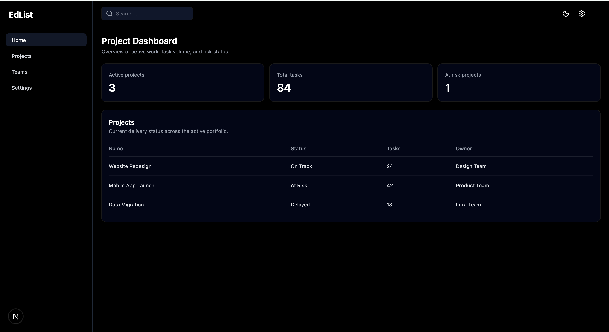

# EdList Dashboard

A modern project management dashboard built with Next.js, TypeScript, and Tailwind CSS.

[](LICENSE)


## Live Demo

- Production URL: [https://edlist-dashboard.vercel.app/](https://edlist-dashboard.vercel.app/)
- GitHub Repository: [https://github.com/Dhanush9999279/edlist-dashboard](https://github.com/Dhanush9999279/edlist-dashboard)

## Preview



## Features

- Dashboard-style layout with sidebar and top navigation
- Clean and responsive user interface
- Projects page for viewing project-related data
- Teams page for team overview
- Settings page for dashboard preferences
- Built with reusable components
- Deployed on Vercel

## Tech Stack

- Next.js
- React
- TypeScript
- Tailwind CSS
- Vercel

## Quick Start

### 1. Clone the repository

```bash
git clone https://github.com/Dhanush9999279/edlist-dashboard.git
```

### 2. Go into the project folder

```bash
cd edlist-dashboard
```

### 3. Install dependencies

```bash
npm install
```

### 4. Start the development server

```bash
npm run dev
```

Open [http://localhost:3000](http://localhost:3000) in your browser.

## Production Build

To test the production build locally:

```bash
npm run build
npm run start
```

## Project Structure

```bash
app/
  components/
    navbar.tsx
    sidebar.tsx
  dashboardWrapper.tsx
  layout.tsx
  page.tsx
  projects/page.tsx
  teams/page.tsx
  settings/page.tsx
public/
  dashboard-preview.png
```

## Why I Built This

This project was built to practice creating a real dashboard UI using the Next.js App Router, reusable React components, and Tailwind CSS styling while following a production-style workflow with GitHub and Vercel.

## Future Improvements

- Authentication and authorization
- Backend API integration
- Database integration with Prisma and PostgreSQL
- Search and filtering
- Charts and analytics widgets
- Role-based dashboard access

## Contributing

Contributions, suggestions, and feedback are welcome. Open an issue or submit a pull request to help improve the project.

## License

This project is licensed under the MIT License. See the `LICENSE` file for details.